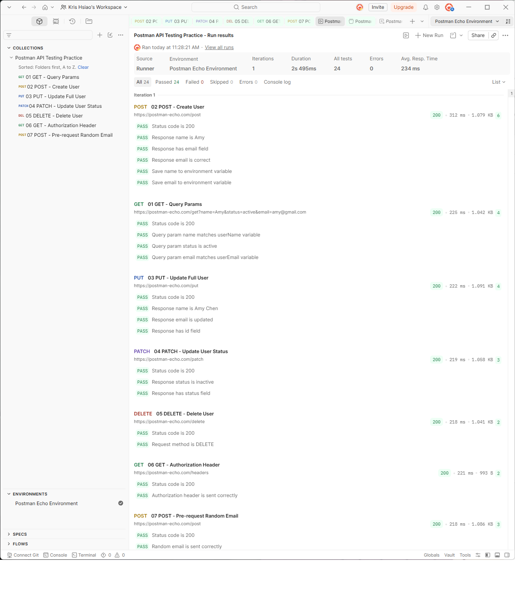

# Postman API Testing Practice

This project is a Postman API testing practice project built for learning API testing fundamentals as a QA beginner.

The collection uses Postman Echo as a demo API and includes basic HTTP methods, environment variables, request headers, automated tests, API chaining, and pre-request scripts.

## Tools Used

- Postman
- Postman Echo API
- Collection Runner
- Environment Variables
- JavaScript Tests in Postman

## What This Project Covers

- GET request with query parameters
- POST request with JSON body
- PUT request for full update
- PATCH request for partial update
- DELETE request
- Authorization header with Bearer token
- Environment variables such as `baseUrl`, `token`, `userName`, and `userEmail`
- API chaining using `pm.environment.set()` and `pm.environment.get()`
- Pre-request script for generating random test data
- Automated response validation with Postman Tests
- Collection Runner execution

## Test Scenarios

| Request | Description |
|---|---|
| 01 GET - Query Params | Send query parameters and validate response args |
| 02 POST - Create User | Send JSON body and validate response data |
| 03 PUT - Update Full User | Update a full user object and validate response |
| 04 PATCH - Update User Status | Update only the user status field |
| 05 DELETE - Delete User | Send DELETE request and validate response |
| 06 GET - Authorization Header | Send Bearer token in Authorization header |
| 07 POST - Pre-request Random Email | Generate a random email before sending request |

## Runner Result

The collection was executed using Postman Collection Runner.

Result:

- Total tests: 24
- Passed: 24
- Failed: 0
- Errors: 0

Screenshot:



## How to Use

1. Import the Postman collection file:

   `Postman_API_Testing_Practice.postman_collection.json`

2. Import the Postman environment file:

   `Postman_Echo_Environment.postman_environment.json`

3. Select the environment in Postman:

   `Postman Echo Environment`

4. Run the collection using Collection Runner.

5. Check the runner result and confirm all tests passed.

## Project Structure

```text
postman-api-testing-practice
├── README.md
├── Postman_API_Testing_Practice.postman_collection.json
├── Postman_Echo_Environment.postman_environment.json
└── screenshots
    └── runner-result-24-passed.png

##Notes

This project uses Postman Echo, so the API does not create real database records.

The purpose of this project is to demonstrate API testing fundamentals and Postman workflow, including request creation, environment variables, automated tests, API chaining, and collection execution.